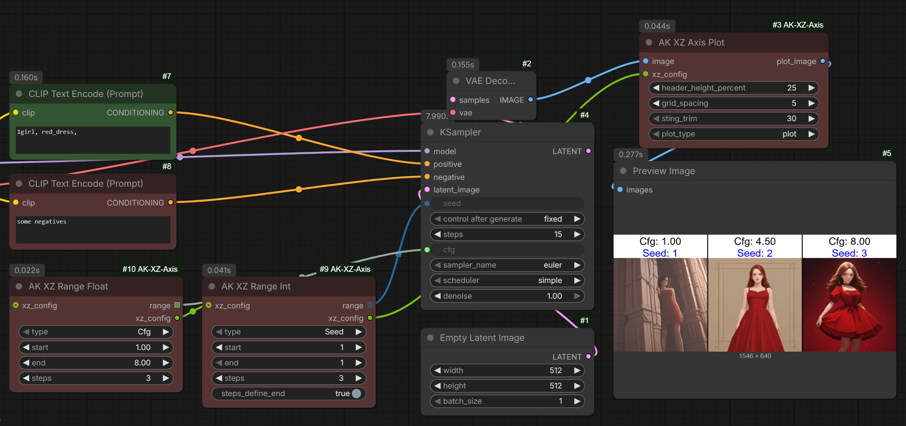

## Other My Nodes

Utilities for working with Lists, Regions, Toggling groups, Caching conditions: [ComfyUI Utils Extra](https://github.com/akawana/ComfyUI-Utils-extra)

Folding of promts in to tree with extra features. Extra shortcuts for editing prompts. Reginal prompting text separation: [ComfyUI Folded Prompts](https://github.com/akawana/ComfyUI-Folded-Prompts)

RGBYP 5-color mask editor: [ComfyUI RGBYP Mask Editor](https://github.com/akawana/ComfyUI-RGBYP-Mask-Editor)

AK XZ Axis so called XY testing for any type of KSampler: [ComfyUI AK XZ Axis](https://github.com/akawana/ComfyUI-AK-XZ-Axis)

---

# ComfyUI-AK-XZ-Axis

A set of nodes for **XY-style testing** of parameters such as **seed, steps, cfg, denoise, prompts, and LoRAs**.

The main advantage of this pack is that it **does not require a custom KSampler** and works with **any KSampler**, including the **default ComfyUI KSampler**.

---

## Why XZ and not XY?

When working with a standard KSampler, you cannot build a true two-dimensional **XY grid** in the classical sense.

In practice, you can only iterate along one axis (X), and optionally inject a second varying parameter inside that iteration. Honestly, I’m not even sure who really needs a full XY grid and in what scenario — but technically, this limitation exists.

That second parameter is what I call **Z**.

So instead of XY, this system operates as **X + Z**.

---

## Demo Workflows

All required demo workflows are located in: /workflows/ folder


---

### AK XZ Axis Plot

The **main visualization node** that creates the final "plot".

In reality, this node:
- Adds **clean, readable headers** to incoming images
- Can output:
  - Images **one by one**, or
  - **All images merged into a single image**

#### Inputs
- **Images** — images coming *after* the KSampler
- **xz_config** — must be connected to any **Range** or **Batch** node from this pack

#### Important behavior
If **only one image** is received, the node does **nothing**:
- No headers
- No processing
- Just passes the image through

This is intentional and allows you to **disable XZ testing instantly** without removing the node from your workflow.



---

### AK XZ Range Int

A universal node for any **integer parameter**, such as:
- `steps`
- `seed`

#### Outputs
- **Array of integers** — connect this directly to the corresponding KSampler widget
- **xz_config** — connect to `AKXZAxisPlot` or another XZ node to enable Z-direction testing

#### Notes
The node is mostly self-explanatory.  
There is an additional boolean option:

- **steps_define_end** — allows you to define only `start` and `steps` instead of manually calculating the end value.

---

### AK XZ Range Float

Same logic as **AK XZ Range Int**, but for **float parameters**, such as:
- `cfg`
- `denoise`

Outputs and usage are identical, just with float values.

---

### AK XZ Batch Prompts

A node for **prompt testing**.

- Supports **up to 10 different prompts**
- Inputs are simple:
  - `positive` — TEXT
  - `negative` — TEXT

> **Important:** These are raw text inputs.  
> The node performs **CLIP encoding internally**.

#### Dynamic inputs
Additional prompt slots appear **only when a PAIR is filled**, meaning:
- Both `positive` **and**
- `negative` must be connected

#### Typical usage
Usually, you:
- Use the **same negative prompt**
- Test multiple **positive prompts**

#### Outputs
- Two arrays:
  - `positive`
  - `negative`

Both must be connected to the corresponding inputs of the KSampler.

- **xz_config** — connect to `AKXZAxisPlot` or another XZ node to enable Z-direction testing

---

### AK XZ Batch Loras

Allows testing of **multiple LoRAs**.

#### Inputs
Each entry is a **PAIR**:
- `model`
- `conditioning`

You:
1. Load a LoRA
2. Encode your positive prompt manually
3. Feed both into this node

Repeat this for each LoRA you want to test.

#### Why no negative?
Negative conditioning is intentionally **not supported** here to avoid:
- Overcomplication
- Node overload

Just connect your negative conditioning **directly to the KSampler**.

#### Outputs
- `models` — array of models
- `conditionings` — array of positive conditionings

Both must be connected to the corresponding KSampler inputs.

- **xz_config** — connect to `AKXZAxisPlot` or another XZ node to enable Z-direction testing


---

## Summary

- Works with **any KSampler**
- No custom sampler required
- Supports:
  - Int ranges
  - Float ranges
  - Prompt batches
  - LoRA batches
- Clean visualization
- Safe passthrough when disabled

Designed to be **simple, flexible, and non-invasive**.


## Installation

You can install this extension in two ways:

### 1. Through ComfyUI Manager (recommended)

Open **ComfyUI Manager → Install**,  
then simply search for **AK XZ** in the search bar.  
Select the extension and click **Install**.

### 2. Manual installation

```bash
cd ComfyUI/custom_nodes
git clone https://github.com/akawana/ComfyUI-AK-XZ-Axis.git

